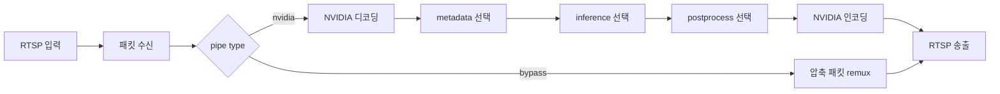

# Pipe Works

Pipe Works는 RTSP 영상 입력을 받아 다른 RTSP 주소로 전달하는 영상 처리 프로젝트입니다. NVIDIA GPU를 이용해 디코딩·사용자 처리·인코딩을 하거나, `bypass` 모드에서 압축된 비디오 패킷을 디코딩과 재인코딩 없이 다시 mux해 전달할 수 있습니다. 설정과 실행 중인 파이프라인은 로컬 웹 콘솔인 Conductor에서 관리합니다.

## 기능

- `nvidia`: NVIDIA NVDEC/NVENC으로 영상을 디코딩하고 다시 인코딩합니다. metadata, inference, postprocess 사용자 단계를 선택적으로 연결할 수 있습니다.
- `bypass`: 압축된 비디오 패킷을 디코딩·재인코딩하지 않고 RTSP 출력으로 remux합니다. metadata, inference, postprocess는 자동으로 비활성화됩니다. RTP 네트워크 데이터그램을 바이트 단위로 복사하는 기능은 아닙니다.
- Conductor: 웹 화면에서 파이프라인 설정을 저장하고 시작·중지하며 상태, 통계, 로그를 확인합니다.

오디오는 현재 전달하지 않습니다. NVIDIA 경로는 CPU 처리로 자동 전환되지 않습니다.

## 처리 흐름



Inference가 활성화되면 hook은 모든 프레임에서 실행되며 다음 형식으로 `infer` 여부를 받습니다.

```python
on_frame(infer: bool, parameters: PipelineArguments, frame: FrameContext) -> FrameContext
```

`infer`는 첫 프레임과 이후 `inference_interval` 프레임 간격의 프레임에서 `True`, 나머지 프레임에서 `False`입니다. 원하는 경우 hook은 매 프레임의 후처리를 수행하고, 무거운 추론만 `if infer:` 안에서 실행할 수 있습니다. `frame`을 반환해 다음 단계로 전달합니다. Postprocess hook은 `on_frame(parameters, frame)` 형식입니다.

## Conductor 실행

```shell
uv run conductor --host 127.0.0.1 --port 8000
```

Conductor가 시작한 파이프라인은 Conductor HTTP 포트를 전달받으므로 통계와 로그 WebSocket도 기본적으로 같은 포트에 연결됩니다.

## 사용자 처리 모듈

사용자 파일은 일반 Python 모듈입니다. 활성화한 파일을 파이프라인 시작 때 불러오며, 파일 변경을 감지하면 새 모듈을 다시 불러옵니다. 성공한 reload는 다음 프레임부터 적용됩니다. Reload가 실패하면 이전 모듈을 계속 사용하고 재시도합니다.

### Metadata

`metadata()`는 프레임 처리에 사용할 최신 객체를 반환합니다. 값은 `frame.metadata`에 담겨 inference와 postprocess에 전달됩니다.

```python
def metadata():
    return {"threshold": 0.5}
```

### Inference

```python
from pipeline.context import FrameContext
from pipeline.arguments import PipelineArguments

def on_frame(
    infer: bool,
    parameters: PipelineArguments,
    frame: FrameContext,
) -> FrameContext:
    if infer:
        # 실제 모델 추론을 수행하고 결과를 기록합니다.
        frame.inference_result = {"objects": []}

    # 필요하면 매 프레임 실행할 처리를 여기에 둡니다.
    return frame
```

`inference_interval=3`이면 프레임 번호 0, 3, 6 등에서 `infer=True`입니다. 그 외 프레임에서도 hook이 호출되므로, inference 결과를 여러 프레임에 유지할 필요가 있다면 모듈 수준 상태나 `frame.inference_result`를 활용할 수 있습니다.

Inference hook에 들어가기 전에 파이프라인이 `frame.data`를 `torch.from_dlpack()`으로 변환합니다. 따라서 inference hook과 그 뒤에 연결된 postprocess hook에서는 `frame.data`가 `torch.Tensor`이며, 사용자 모듈에서 DLPack 변환을 다시 할 필요가 없습니다. NVENC 직전에는 파이프라인이 Tensor를 DLPack capsule로 내보냅니다. PyNvVideoCodec GPU 입력은 CUDA Array Interface 객체를 요구하므로 인코더에는 같은 GPU 메모리를 공유하는 원본 디코더 프레임 객체를 전달하며, `encode.py`는 PyTorch에 의존하지 않습니다. 추론 결과는 `frame.inference_result`에 기록합니다.

### Postprocess

```python
from pipeline.context import FrameContext
from pipeline.arguments import PipelineArguments

def on_frame(parameters: PipelineArguments, frame: FrameContext) -> FrameContext:
    # frame.inference_result 등을 사용해 프레임을 후처리합니다.
    return frame
```

예제 파일은 [`examples/`](examples/) 디렉터리에서 볼 수 있습니다. NVIDIA 예제는 GPU 프레임 버퍼를 직접 다루므로 CPU 환경에서 그대로 실행할 수 없습니다.
## Conductor HTTP API

Conductor defaults to `http://127.0.0.1:8000` (override with `--host` and `--port`). Process settings are JSON and include the pipeline configuration and `auto_start`.

| Method | Path | Purpose |
|---|---|---|
| GET | `/` | Serve the Conductor web console. |
| GET | `/api/processes` | Return all saved process definitions. |
| POST | `/api/processes` | Create or upsert a process definition; returns the saved definition (201). |
| PUT | `/api/processes?process_id={id}` | Update an existing definition. The body `process_id` must match the query value. |
| DELETE | `/api/processes?process_id={id}` | Delete a saved definition (204). This does not stop a running pipeline. |
| GET | `/api/processes/status` | Return the state of all saved processes. |
| GET | `/api/processes/status?process_id={id}` | Return one process state: `running` or `stopped`. |
| POST | `/api/processes/start?process_id={id}` | Start the saved pipeline definition. |
| POST | `/api/processes/stop?process_id={id}` | Force-stop the matching pipeline process tree. |
| WS | `/ws/process-status` | Stream all process states once per second to the console. |

The static console assets are served from the root path. Invalid settings return HTTP 422; missing saved definitions generally return 404. Process status inspection can return 503 when the operating system process lookup fails. The module opener is Windows-only.
